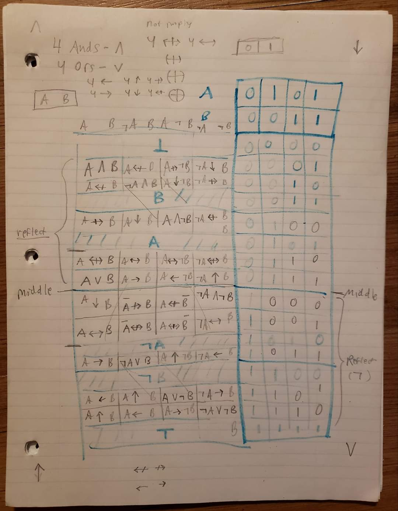

<<<<<<< HEAD
# logical-connectives
Various logical operators and connectives
=======
# logical-connectives
Various logical operators and connectives

Here is a chart of the sixteen binary operators you mentioned, with the numbering in binary from 0000 (bottom) to 1111 (top):

Binary	Operator Name	Symbol
1. 0000	Bottom (Contradiction)	⊥
1. 0001	Nor	↓
1. 0010	Converse nonimplication	↚
1. 0011	Not A	~A
1. 0100	Nonimplication ↛
1. 0101	Not B	~B
1. 0110	Xor	↮
1. 0111	Nand	↑
1. 1000	And	∧
1. 1001	Equivalence (Iff)	↔
1. 1010	B	B
1. 1011	Implication (If then)	→
1. 1100	A	A
1. 1101	Converse implication	←
1. 1110	Or	∨
1. 1111	Top (Tautology)	⊤

  
  
<i>Logical Operator Sudoku</i>

>>>>>>> fd4eb357ef1b2727b9e31d55fe2af14433493ed4
