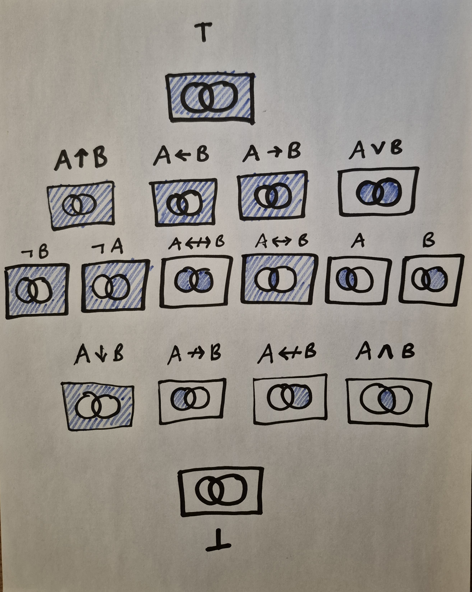

# Logical Connectives

Every Boolean function of two inputs can be written as a four-bit output
column. The sixteen possible columns are the vertices of the Boolean
tesseract Q₄ and form the rank structure 1–4–6–4–1.



## Interactive field guide

The dependency-free site in `docs/` turns the tesseract into an interactive
catalogue. Every connective has one canonical four-bit definition from which
the index card, prose description, truth table, and live evaluator are
generated. This keeps the explanation and executable behaviour aligned.

Open `docs/index.html` directly, or serve the repository root with any static
file server and visit `/docs/`. Run the catalogue check with:

```sh
node tests/connectives.test.mjs
```

The site is an interactive companion to *The Geometry of Expressibility:
Logic at the Corners of a Continuous Relational Space*, originally developed
under the title *From NAND to Xanadu*.
The complete LaTeX manuscript is available at
[essay/geometry-of-expressibility.tex](essay/geometry-of-expressibility.tex).

The complete three-input Boolean-function space has 2⁸ = 256 vertices and is
therefore Q₈. Any Q₄ → Q₅ extension denotes one additional independent
coordinate on the two-input function space rather than the complete
three-input function space.
